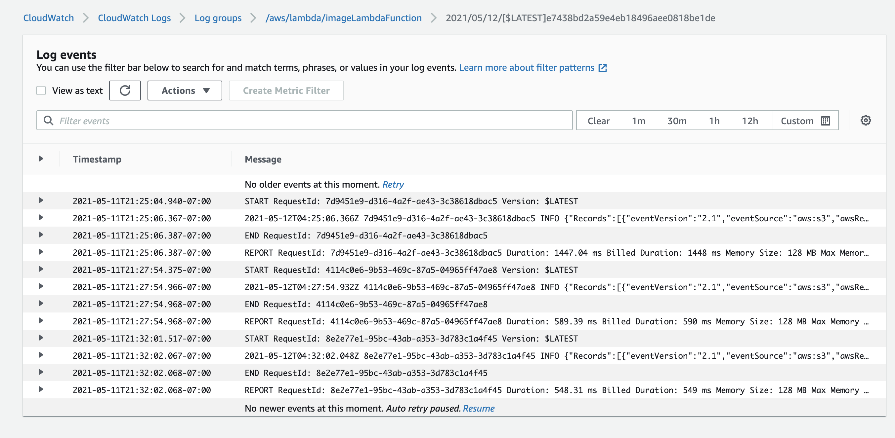
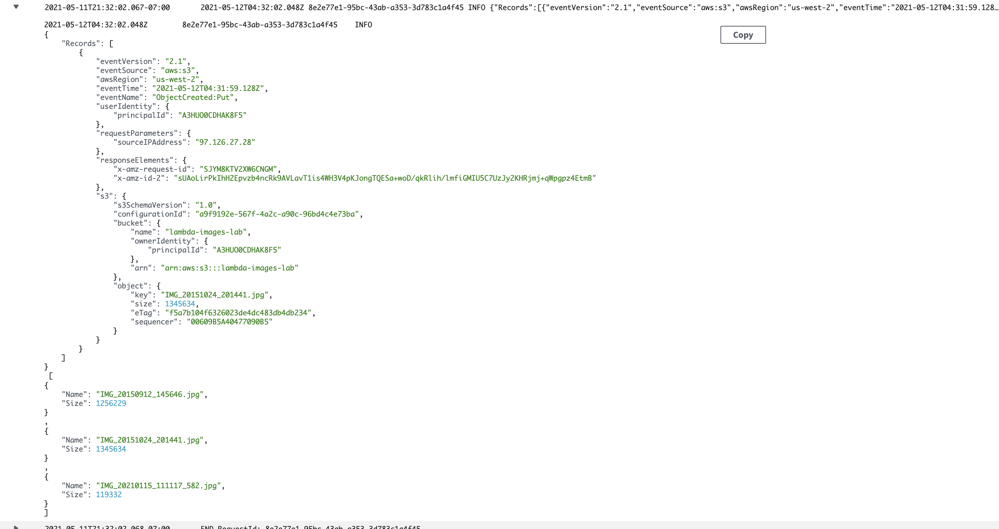

# Lab: Class 17

## Project: image-lambda

### Author: Audrey Patterson

## Screenshots

- Log Events Screenshot

- Screenshot of the console log

## Links and Resources

- [image.json](./images.json)

- [AWS Docs - use an s3 trigger](https://docs.aws.amazon.com/lambda/latest/dg/with-s3-example.html)
- [AWS Docs - listObjects method](https://docs.aws.amazon.com/AmazonS3/latest/API/API_ListObjects.html#API_ListObjects_ResponseSyntax)

## Issues I encountered

- Forgot to zip the node modules in with my index.js file because I was brining in aws.S3
- I kept getting a constant variable error and didn't realize I had `const` my imgArray and then tried to reassign it later...
- I'm unable to get the `putObject` function working to send the json file back to the s3 bucket
